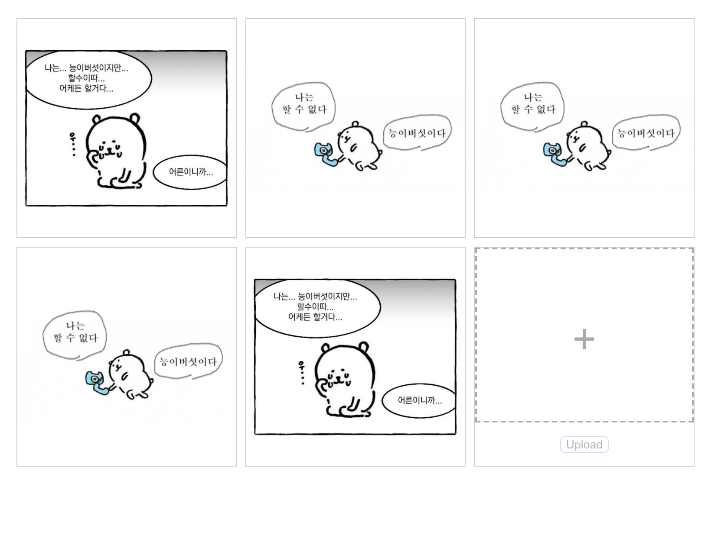

# 드래그 앤 드롭하여 이미지 서버로 보내기



- English readme is [here](./readme-en.md)

Wordpress-like 관리자 도구를 만들기 위한 연습 중 첫 번째 단계로, Frontend에 React, Backend에 Express를 사용하여, 이미지를 저장 및 serve합니다.

## 설치

`npm install` 또는 `yarn` 중, 선호하시는 패키지 매니저를 이용해 설치하시면 됩니다.

서버에서 환경변수를 사용하기 때문에, 다음의 환경변수들을 직접 설정하시거나 `server/.env` 파일에 저장해 주셔야 합니다:

```bash
# AWS 계정
AWS_ACCESS_KEY=YOUR_ACCESS_KEY
AWS_SECRET_ACCESS_KEY=YOUR_SECRET_ACCESS_KEY

# 데이터베이스: postgresql을 이용함
RDS_DB_NAME=POSTGRES_DB_NAME
RDS_USERNAME=POSTGRES_MASTER_USER_NAME
RDS_PASSWORD=YOUR_PASSWORD
RDS_HOSTNAME=RDS_HOSTNAME # 개발 단계에서는 `localhost`이용가능

# S3
BUCKET_NAME=YOUR_S3_BUCKET_NAME
```

마지막으로, 환경변수의 `process.env.BUCKET_NAME`과 일치하는 s3 버켓을 가지고 있으셔야 서버가 제대로 동작합니다.

## 구동

`npm run client` 또는 `yarn client`를 이용해 React 클라이언트만 구동할 수 있습니다.

`npm run server` 또는 `yarn server`를 이용해 Express 서버만 구동할 수 있습니다.

`npm start` 또는 `yarn start`를 이용해 둘 모두를 구동할 수 있습니다.

셋 모두 개발모드로 실행됩니다.

## 빌드

TODO
